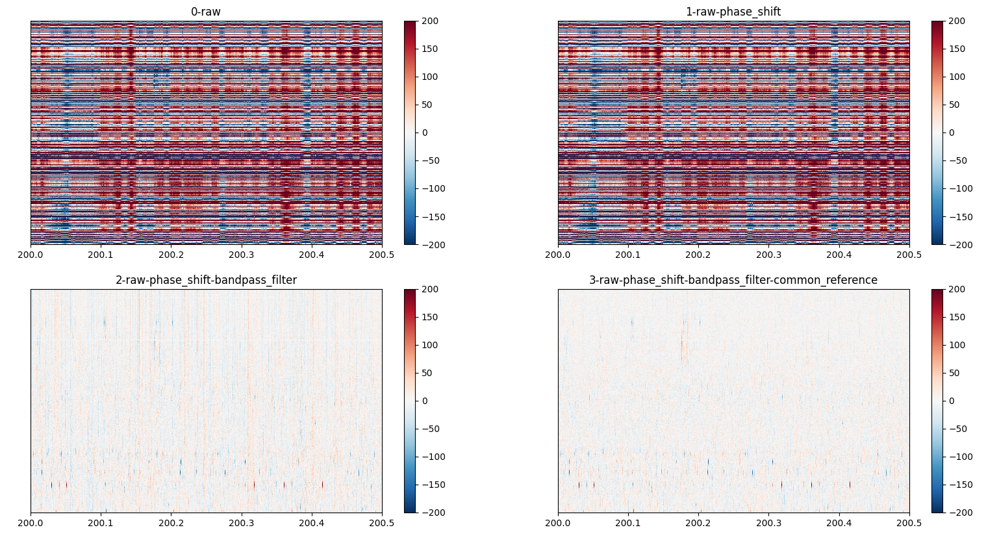

> **Warning** 
> **SWC Ephys is not sufficiently tested to be used in analysis. This release is only for testing. Do not use for your final analyses.**

> **Warning** **Limitations**
> - works only on SpikeGLX recordings with 1 gate, 1 trigger, 1 probe (per run, e.g. g0, t0, imec0)
> - requires standard input folder format
> - only run one subject / run at a time
> - has limited preprocessing options (`tshift`, `bandpass_filter`, `common median reference`)
> - no options to remove potentially large intermediate files
> - installation / running on HPC is a bit clunky. In future this can be simplified with SLURM jobs organised under the hood and setting up a HPC module.
> - untested!


# Features

- preprocess SpikeGLX data (`tshift`, `bandpass_filter`, `common median reference`)
- spike sorting (`kilosort2`, `kilosort2_5`, `kilosort3`)
- quality check measures on the sorting results

# Local Installation

Sorting requires a NVIDIA GPU and so is currently only available using the SWC's High-Performance Computer (HPC). However, local installation is useful for visualising the preprocessing steps prior to running the full pipeline (see 'Visualisation' below).

To install locally, clone the repository to your local machine using git. 

`git clone git@github.com:neuroinformatics-unit/swc_ephys.git`

Change directory to the repo and install using

`pip install -e .`

or, to also install developer dependencies

`pip install -e .[dev]` 

or if using the zsh shell

`pip install -e ".[dev]"` 

After installation, the module can be imported with `import swc_ephys`.

## Running on the HPC

Currently, sorting is required to run on the SWC HPC with access to `/ceph/neuroinformatics`. 

To connect and run on the HPC (e.g. from Windows, macOS or Linux terminal):

`ssh username@ssh.swc.ucl.ac.uk`

`ssh hpc-gw1`

The first time using, it is necessary to steup and install `swc_ephys`. It is strongly recommended to make a new conda environment on the HPC, before installing `swc_ephys`.

`module load miniconda`

`conda create --name swc_ephys python=3.10`

`conda activate swc_ephys`

and install swc_ephys and it's dependencies:

`mkdir ~/git-repos`

`cd ~/git-repos`

`git clone https://github.com/JoeZiminski/swc_ephys.git`

`cd swc_ephys`

`pip install -e .`

Before running, it is necessary to request use of a GPU node on the HPC to run spike sorting with KiloSort. To run preprocessing and spike sorting, create a script using the API or call from the command line interface (instructions below). 

`srun -p gpu --gres=gpu:1 -n 8 --mem=40GB --pty bash -i`

`module load cuda`

`module load miniconda`

`conda activate swc_ephys`

`python my_pipeline_script.py`

# Quick Start Guide

SWC Ephys (currently) expects input data to be stored in a `rawdata` folder. A subject (e.g. mouse) data should be stored in the `rawdata` folder and contain SpikeGLX output format (example below). **Currently, only recordings with 1 gate, 1 trigger and 1 probe are supported (i.e. index 0 for all gate, trigger probe, `g0`, `t0` and `imec0`)**.

```
└── rawdata/
    └── 1110925/
        └── 1110925_test_shank1_g0/
            └── 1110925_test_shank1_g0_imec0/
                ├── 1110925_test_shank1_g0_t0.imec0.ap.bin
                └── 1110925_test_shank1_g0_t0.imec0.ap.meta
```


## API (script)

Example code to analyse this data in this format is below:

```
from swc_ephys.pipeline.full_pipeline import run_full_pipeline

base_path = "/ceph/neuroinformatics/neuroinformatics/scratch/ece_ephys_learning"

if __name__ == "__main__":

    run_full_pipeline(
        base_path=base_path,
        sub_name="1110925",
        run_name="1110925_test_shank1",
        config_name="test",
        sorter="kilosort2_5",
    )
```

`base_path` is the path containing the required `rawdata` folder. 

`sub_name` is the subject to run, and `run_name` is the SpikeGLX run name to run. 

`configs_name` contains the name of the preprocessing / sorting settings to use (see below)

`sorter` is the name of the sorter to use (currently supported is `kilosort2`, `kilosort2_5` and `kilosort3`)

Note `run_full_pipline` must be run in the `if __name__ == "__main__"` block as it uses the `multiprocessing` module.

## Command Line Interface

> **Warning** Command Line Interface is experimental. Some options may not be currently available through the command line interface.

Required positional arguments `base_path`, `sub_name` and `run_name` 

and optional arguments `--config_name` (default `test`), `--sorter` (default `kilosort2_5`) and flag `--use-existing-preprocessed-file`. If set, this last flag will use an existing `preprocessed` recording file for the subject if it is found.

For example, to run the script above using the command line:

```
swc_ephys \
/ceph/neuroinformatics/neuroinformatics/scratch/ece_ephys_learning \
1110925 \
1110925_test_shank1 \
--config-name test \
--sorter kilosort2_5
```

## Output

Output of spike sorting will be in a `derivatives` folder at the same level as the `rawdata`. The subfolder organisation of `derivatives` will match `rawdata`. 

Output are the saved preprocessed data, spike sorting results as well as a list of [quality check measures](https://spikeinterface.readthedocs.io/en/latest/modules/qualitymetrics.html). For example, the full output of a sorting run with the input data as above is:

```
├── rawdata/
│   └── ...
└── derivatives/
    └── 1110925/
        └── 1110925_test_shank1_g0  /
            └── 1110925_test_shank1_g0_imec0/
                ├── preprocessed/
                │   ├── data_class.pkl
                │   └── si_recording
                ├── kilosort2_5-sorting/
                    ├── in_container_sorting/
                    ├── sorter_output/
                    ├── waveforms/
                    │   └── <spikeinterface waveforms output>
                    ├── quality_metrics.csv
                    ├── spikeinterface_log.json
                    ├── spikeinterface_params.json
                    └── spikeinterface_recording.json
```


**preprocessed**: 

- Binary-format spikeinterface recording from the final preprocessing step (`si_recording`) 2) `data_class.pkl` swc_ephys internal use.

**-sorting output (e.g. kilosort2_5-sorting, multiple sorters can be run)**: 

- <u>in_container_sorting</u>:  stored options used to run the sorter

- <u>sorter_output</u>: the full output of the sorter (e.g. kilosort .npy files)

- <u>waveforms</u>: spikeinterface [waveforms](https://spikeinterface.readthedocs.io/en/latest/modules/core.html#waveformextractor) output containing AP 
waveforms for detected spikes

- <u>quality_metrics.csv</u>: output of spikeinterface  [quality check measures](https://spikeinterface.readthedocs.io/en/latest/modules/qualitymetrics.html)

# Set Preprocessing Options

Currently supported are multiplexing correction or tshift (termed  `phase shift` here), common median referencing (CMR) (termed `common_reference` here) and bandpass filtering (`bandpass_filter`). These options provide an interface to [SpikeInterface preprocessing](https://spikeinterface.readthedocs.io/en/0.13.0/modules/toolkit/plot_1_preprocessing.html) options, more will be added soon.

Preprocessing options are set in `yaml` configuration files stored in `sbi_ephys/sbi_ephys/configs/`.  A default pipeline is stored in `test.yaml`.

Custom preprocessing configuration files may be passed to the `config_name` argument, by passing the full path to the `.yaml` configuration file. For example:

```
'preprocessing':
  '1':
  - phase_shift
  - {}
  '2':
  - bandpass_filter
  - freq_min: 300
    freq_max: 6000
  '3':
  - common_reference
  - operator: median
    reference: global

'sorting':
  'kilosort3':
    'car': False
    'freq_min': 300
```

Configuration files are structured as a dictionary where keys indicate the order to run preprocessing The values hold a list in which the first element is the name of the preprocessing step to run, and the second element a dictionary containing kwargs passed to the spikeinterface function.

# Visualise Preprocessing

Visualising preprocesing output can be run locally to inspect output of preprocessing routines. To visualise preprocessing outputs:

```
from swc_ephys.pipeline.preprocess import preprocess
from swc_ephys.pipeline.visualise import visualise

base_path = "/ceph/neuroinformatics/neuroinformatics/scratch/ece_ephys_learning"
sub_name = "1110925"
run_name = "1110925_test_shank1"

data = preprocess(base_path=base_path, sub_name=sub_name, run_name=run_name)

visualise(
    data,
    steps="all",
    mode="map",
    as_subplot=True,
    channel_idx_to_show=np.arange(10, 50),
    show_channel_ids=False,
    time_range=(1, 2),
)
```

This will display a plot showing data from all preprocessing steps,  displaying channels with idx 10 - 50, over time period 1-2. Note this requires a GUI (i.e. not run on the HPC terminal) and is best run locally.


